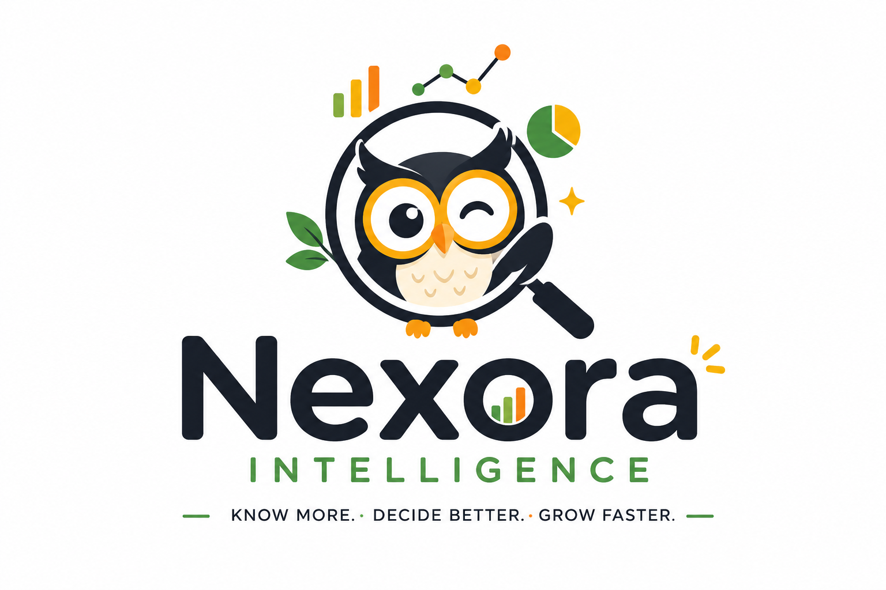

<div align="center">
  
  <h1>🦉 Nexora AI</h1>
  <p><strong>Enterprise-Grade Company Intelligence & Strategic Decision Platform</strong></p>
  <p>
    <i>Research • Analyze • Understand Any Company in Minutes.</i>
  </p>
</div>

---

## 🧐 What is Nexora AI?

Nexora AI is an autonomous, AI-powered company intelligence platform designed for executives, investors, and strategists. It automates the agonizing process of manual web research, competitor analysis, financial mapping, and technology stack identification.

Instead of manually scraping Crunchbase, Wikipedia, GitHub, and news sites, you simply input a company name. Nexora orchestrates a **swarm of AI agents** to crawl the web, synthesize unstructured data, and generate a beautiful, interactive executive dashboard. It also builds a persistent RAG (Retrieval-Augmented Generation) knowledge base, providing you with an always-on AI Assistant to answer deep, strategic questions.

---

## 🔄 How It Works (The Complete Architecture Flow)

Nexora AI relies on a highly optimized, decoupled architecture (FastAPI Backend + Next.js Frontend) to deliver comprehensive intelligence in seconds, bypassing API rate limits through intelligent agent orchestration.

### Phase 1: User Input & Initialization
1. **Search Request:** The user enters a company name (e.g., "Stripe") via the Next.js frontend.
2. **Backend Processing:** The request hits the FastAPI backend. A unique job ID is generated and stored in a persistent SQLite job store. Server-Sent Events (SSE) instantly open a connection to stream progress updates back to the UI.

### Phase 2: Parallel Data Gathering (The Swarm)
Using Python's `asyncio` and custom web crawlers, Nexora simultaneously fires off search retrievers to gather raw data from across the web. To avoid rate limits, the system utilizes a token-bucket rate limiter.
- **Tavily Search / Crawl:** Fetches the official website, press releases, and recent news.
- **Wikipedia:** Gathers history, business model, and historical financial context.
- **Financial APIs / Crunchbase:** Extracts funding, valuation, and leadership data.

### Phase 3: Multi-Agent Synthesis (The Multi-LLM Pipeline)
Once the raw, unstructured data is collected, it is funneled into Nexora's **Multi-LLM Pipeline** (orchestrating Llama 3.3 via Groq and Gemini Pro). The data is split into multiple concurrent agent tasks:
- **Financial Agent:** Extracts revenue, funding rounds, valuation, and employee counts.
- **Product & Competitor Agent:** Identifies the core product offerings and maps the competitive landscape.
- **Strategic Agent (SWOT):** Synthesizes Strengths, Weaknesses, Opportunities, and Threats into an executive summary matrix.
- **Reviewer Agent:** Validates the outputs, ensuring the narrative matches the hard data without hallucination.

### Phase 4: Vector Embedding & Knowledge Base (RAG)
As the intelligence is synthesized, the raw data is chunked and embedded into a local **ChromaDB Vector Store**. 
- This creates an isolated, persistent semantic database uniquely built for that specific company in real time.

### Phase 5: Dashboard Rendering & AI Assistant
- **Dashboard:** The Next.js frontend receives the final parsed JSON from the backend via SSE and instantly renders an interactive, premium Executive Dashboard (featuring Recharts visualizations, SWOT matrices, and Health Scores).
- **Global AI Assistant:** A globally available floating Chat Widget (Nexora AI Assistant) activates. When the user asks a question (e.g., *"What is their biggest weakness compared to Square?"*), the assistant queries the newly generated ChromaDB vector store to provide highly accurate, cited answers based *only* on the retrieved context.

---

## 🏗️ Tech Stack

### Frontend (Client-Side)
- **Framework:** Next.js 14+ (App Router, React 18)
- **Styling:** Tailwind CSS (Premium Apple/Linear aesthetic with strict 8px grid system)
- **Animations:** Framer Motion (Glassmorphism, micro-interactions, layout transitions)
- **Data Visualization:** Recharts
- **Icons:** Lucide React

### Backend (Server-Side)
- **Framework:** FastAPI (Python 3.10+)
- **Database:** SQLite (Relational State/Job Tracking)
- **Vector Store:** ChromaDB (Local semantic search and embeddings)
- **AI / LLM Orchestration:** LangChain, Groq API (Llama 3.3), Google Gemini API
- **Concurrency:** `asyncio` with custom Token-Bucket Rate Limiting

---

## 🚀 Getting Started

### Prerequisites
- Node.js (v18+)
- Python (3.10+)
- API Keys Required: `GROQ_API_KEY`, `GEMINI_API_KEY`, `TAVILY_API_KEY` (Optional but recommended)

### 1. Backend Setup
```bash
cd backend
python -m venv venv
source venv/bin/activate  # On Windows: venv\Scripts\activate
pip install -e .
cp .env.example .env      # Add your API keys to .env
uvicorn app.main:app --reload --port 8000
```

### 2. Frontend Setup
```bash
cd frontend
npm install
cp .env.example .env.local
npm run dev
```
Open [http://localhost:3000](http://localhost:3000) in your browser to start generating reports.

---

## 🛡️ License

Copyright © 2026 Nexora AI. All rights reserved.
This project is proprietary and confidential. Unauthorized copying, modification, or distribution is strictly prohibited.
